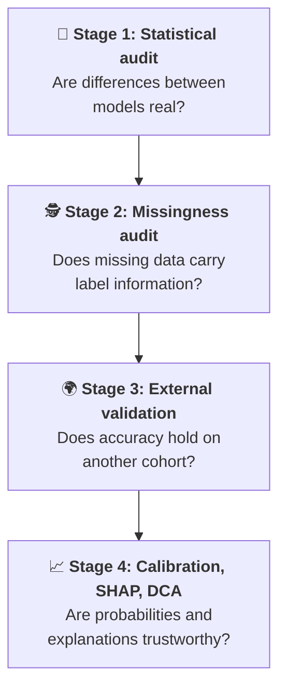
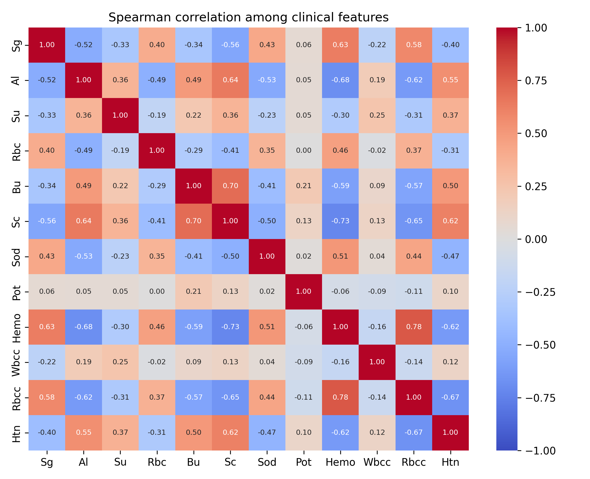

<div align="center">

# 🩺 How Much of Reported Chronic Kidney Disease Prediction Accuracy Is Real?
### A Statistical Audit, Leakage Analysis, and External Validation of Hybrid Stacking on the UCI Benchmark

[](https://github.com/HarshaAppikatla/Chronic-Kidney-Disease)
[](https://www.python.org/)
[](https://scikit-learn.org/)
[](https://xgboost.readthedocs.io/)
[](https://www.tensorflow.org/)
[](LICENSE)
[](https://colab.research.google.com/github/HarshaAppikatla/Chronic-Kidney-Disease/blob/main/SPM_RESEARCH_7.ipynb)

<p align="center">
  <b>Reproducibility package • ICMLDE 2026 (Procedia Computer Science)</b><br>
  Corrected Repeated CV • Missing-Data Audit • External Validation • Calibration • SHAP • Decision Curve Analysis
</p>

---

### ⚡ Audit at a Glance

| ⚖️ Model Differences | 🕵️ Informative Missingness | 🛡️ In-Fold Imputation | 🌍 External Cohort |
| :---: | :---: | :---: | :---: |
| **0 / 21** | **80.9%** | **98.85%** | **98.0%** |
| accuracy comparisons significant among 7 models | accuracy from missingness flags alone (AUC 0.850) | XGBoost accuracy, in-fold imputation (*p* = 0.70 vs pre-imputed) | accuracy on 200 independent patients (95% CI 95.0–99.5) |

</div>

> ⚠️ **Research use only.** Results come from two small, retrospective hospital datasets. They do not establish clinical generalizability and must not be used for clinical decisions.

---

## 💡 The Core Question

> **Many papers report 95–100% accuracy on the 400-record UCI chronic kidney disease (CKD) benchmark, almost always from a single 320/80 split. At this sample size a single split carries a confidence interval several points wide. Are the reported differences between models, and the near-ceiling accuracy itself, real?**



| Stage | Investigation | What we found |
| :---: | :--- | :--- |
| 🔬 | **Statistical audit** | **0 of 21** pairwise accuracy differences among 7 models are significant (Nadeau–Bengio corrected, Holm adjusted, 50 paired folds). Among 17 models only naive Bayes is significantly worse. Only the decision tree has credibly lower AUC. |
| 🕵️ | **Missingness audit** | **231 of 400 patients (57.8%)** have at least one imputed cell; 9 of 13 columns have label-associated missingness. Flags alone predict CKD with **80.9% accuracy**. |
| 🌍 | **External validation** | 98.0% accuracy, sensitivity 100% (97.2–100), specificity 94.4% (86.4–98.5) on one small, single-site, retrospective cohort. |
| 📈 | **Calibration, SHAP, DCA** | XGBoost is best calibrated; stacks are not better calibrated than their base learners. SHAP shares are shared among correlated markers. DCA range 0.05–0.30 pre-specified. |

---

## ⚖️ Common Assumptions vs. What the Audit Shows

| Common assumption | What the audit shows | Why |
| :--- | :--- | :--- |
| *"Hybrid ANN stacks are superior"* | **Not demonstrated.** Differences are statistically indistinguishable. | Under Nadeau–Bengio corrected tests, Logistic Regression (97.95%) and ANN+XGB (98.90%) cannot be separated. |
| *"Mean imputation is harmless"* | **Missingness carries label information.** | A model using only missingness flags (no lab values) reaches 80.9% accuracy against a 62.5% baseline. |
| *"Near-100% accuracy is just an imputation artifact"* | **Not by itself.** | In-fold imputation leaves accuracy unchanged, and all 169 fully observed patients are classified correctly. Clinical signal and missingness signal cannot be separated from aggregate accuracy. |
| *"Models fitted on UCI-400 collapse externally"* | **Not on this cohort.** | 98.0% accuracy on UCI #857, unchanged (99.0%) after removing coarse inputs. The cohort is small, single-site and similar in setting, so this is not proof of broad transfer. |

---

## 🎯 Key Findings

<details open>
<summary><b>1. Architecture equivalence: no model is demonstrably better</b></summary>
<br>

5-fold stratified CV repeated 10 times (50 paired folds) with Nadeau–Bengio variance correction and Holm adjustment:

- None of the 21 pairwise accuracy comparisons is significant (smallest raw *p* = 0.053).
- The **Decision Tree** is the only model with credibly lower AUC: significantly worse than each of the other six (Holm-adjusted *p* = 0.036). DeLong's test on pooled out-of-fold predictions agrees (*p* < 0.05 in 10 of 10 repeats for exactly those six pairs). Because fold-models share training data, DeLong's *p*-values are anti-conservative, so the corrected per-fold test is primary.
- Ten further published-style and class-weighted models on the same folds: only naive Bayes (91.0%) differs significantly from the hybrid. Soft voting (99.30%) and Extra Trees (99.20%) are nominally highest but not significantly different.
- Class imbalance (1.67:1) does not drive the results: balanced accuracy is 97.3–98.8%, MCC 0.943–0.977, and class weighting changes balanced accuracy by only +0.14 to +0.22 points.

</details>

<details open>
<summary><b>2. The missingness audit: widespread and informative</b></summary>
<br>

We aligned the distributed CSV row by row with the raw UCI file (100% match on observed entries) to recover the true missing cells:

- **808 of 5,200 cells (15.5%)** were imputed; **231 of 400 patients (57.8%)** are affected. Every column contains imputed cells (0.5% for `Htn` up to 38.0% for `Rbc`).
- **Nine columns** have a CKD rate among imputed cells of 88–95%, against 43–59% among observed cells: `Rbc`, `Rbcc`, `Wbcc`, `Pot`, `Sod`, `Hemo`, `Su`, `Sg`, `Al`.
- A label-free heuristic first flagged five columns (`Sod`, `Pot`, `Hemo`, `Wbcc`, `Rbcc`); 166 patients (41.5%) have an imputed value in at least one of them. The ground-truth audit shows the problem is larger.
- Missingness flags alone: **80.9% accuracy, AUC 0.850** (all 13 flags); 72.25% accuracy, AUC 0.770 (the five original flags).

</details>

<details open>
<summary><b>3. Does imputation explain the accuracy? Not by itself, but we cannot rule out shared signal</b></summary>
<br>

| Analysis (XGBoost, 50 folds) | Accuracy (%) | *p* |
| :--- | :---: | :---: |
| W0: pre-imputed CSV | 98.75 | 0.70 (vs W1) |
| W1: true NaNs, in-fold median imputation | 98.85 | — |
| W2: W1 + in-fold missingness indicators | 99.17 | 0.38 (vs W1) |
| W3: W1 without the nine columns with >10% missing | 89.43 | <0.001 (vs W1) |
| V1 → V4: drop the five originally flagged columns | 98.75 → 97.08 (−1.68 pp) | 0.070 |

In-fold imputation does not change accuracy, and accuracy is perfect on the 169 fully observed patients. But dropping the heavily imputed columns costs about 9 points, and aggregate accuracy cannot tell us whether that information is clinical content or collection practice. A non-significant difference (*p* = 0.070) is not evidence of equivalence. Accuracy is lowest in patients with three or more missing values (specificity 76.4% for XGBoost, from only about 11 non-CKD patients).

</details>

<details open>
<summary><b>4. External validation on an independent hospital cohort</b></summary>
<br>

XGBoost trained on UCI-400 (12 shared features) and applied unchanged to UCI #857 (*n* = 200; 128 CKD / 72 non-CKD):

| Metric | Value (95% CI) |
| :--- | :---: |
| Accuracy | **98.0%** (95.0–99.5, exact) |
| AUC | 0.9985 |
| Sensitivity | **100%** (97.2–100): 0 of 128 CKD cases missed |
| Specificity | 94.4% (86.4–98.5): 4 false positives |
| PPV / NPV | 97.0% (92.4–99.2) / 100% (94.7–100) |

**Interpret with caution.** The cohort is small, single-site and retrospective, with undocumented sampling. Both datasets are South Asian hospital samples with similar prevalence (62.5% and 64.0%), and neither records sex. Serum creatinine, blood urea and potassium are effectively collapsed to one value in the external data (accuracy 99.0% without them). At lower prevalence the same specificity gives a much lower PPV: 48.6% at 5%, 66.7% at 10%, 81.8% at 20%.

</details>

---

## 📊 Benchmark Table

Repeated stratified CV (5 folds × 10 repeats). CIs are Nadeau–Bengio corrected.

| Model | Accuracy (%) | 95% CI | AUC | F1 | Brier | Accuracy differs significantly from others? |
| :--- | :---: | :---: | :---: | :---: | :---: | :---: |
| Hybrid (ANN+XGBoost) | 98.90 | [97.76, 100.0] | 0.9995 | 0.9912 | 0.0098 | No |
| Random Forest | 98.75 | [97.63, 99.87] | 0.9998 | 0.9901 | 0.0112 | No |
| XGBoost | 98.60 | [97.35, 99.85] | 0.9996 | 0.9888 | 0.0097 | No |
| Hybrid (ANN+RF) | 98.45 | [97.02, 99.88] | 0.9996 | 0.9876 | 0.0110 | No |
| SVM (RBF) | 98.35 | [96.99, 99.71] | 0.9996 | 0.9867 | 0.0097 | No |
| Logistic Regression | 97.95 | [96.51, 99.39] | 0.9994 | 0.9834 | 0.0133 | No |
| Decision Tree | 97.33 | [95.74, 98.91] | 0.9730 | 0.9784 | 0.0268 | No (AUC is lower, *p* = 0.036) |

Models are listed by nominal accuracy only; the differences are not statistically meaningful. Sensitivity, specificity, precision and NPV with exact Clopper–Pearson CIs are in the paper (Table 4).

> **Why XGBoost is 98.60% here but 98.75% in the ablations.** The seven-model benchmark uses `StratifiedKFold` with seeds 42–51. The ablation, in-fold imputation and 12-feature reference analyses use a separate partition (`RepeatedStratifiedKFold`, random state 42), shared across their own variants. The difference is one of partitions, not of models.

---

## 🩺 Clinical Feature Glossary

The 13 predictors in `new_model.csv`. This table is background description added for readers; it is not taken from the dataset documentation.

| Feature | Description | Units / coding | Typical reference | Relevance to CKD |
| :--- | :--- | :--- | :--- | :--- |
| **`Hemo`** | Hemoglobin | g/dL | 13.5–17.5 (M), 12.0–15.5 (F) | Reduced erythropoietin production can cause anaemia. |
| **`Sg`** | Urine specific gravity | Ratio | 1.010–1.025 | Loss of tubular concentrating capacity lowers it. |
| **`Al`** | Urine albumin | Ordinal 0–5 | 0 (negative) | Albuminuria reflects glomerular damage. |
| **`Sc`** | Serum creatinine | mg/dL | 0.7–1.3 | Rises as filtration declines. |
| **`Bu`** | Blood urea | mg/dL | 15–45 | Retained when waste clearance is impaired. |
| **`Rbcc`** | Red blood cell count | million/mm³ | 4.5–5.9 | Often reduced alongside anaemia. |
| **`Wbcc`** | White blood cell count | cells/mm³ | 4,000–11,000 | Non-specific marker of inflammation. |
| **`Sod`** | Serum sodium | mEq/L | 135–145 | Sodium handling may be disturbed. |
| **`Pot`** | Serum potassium | mEq/L | 3.5–5.0 | Hyperkalaemia can occur with reduced nephron mass. |
| **`Su`** | Urine sugar | Ordinal 0–5 | 0 (negative) | Linked to diabetic kidney disease. |
| **`Bp`** | Blood pressure | mmHg | about 120/80 | Hypertension is a cause and a consequence of CKD. |
| **`Rbc`** | Red blood cells (urine) | Binary, **1 = normal**, 0 = abnormal | Normal | Abnormal findings can indicate glomerular injury. |
| **`Htn`** | Hypertension | Binary, 1 = yes | No | Major comorbidity. |

The 13-variable subset comes from the distributed CSV; we did not select it, and its curators do not document the rationale. Twelve predictors are shared with the external cohort (`Bp` is excluded because the external blood-pressure fields are not comparable).

---

## 🔬 Calibration, Explainability and Clinical Utility

### 1. Are the probabilities calibrated?

Calibration (median over the 10 repeats): XGBoost is best calibrated (ECE 0.0148, Spiegelhalter *p* = 0.283). The stacked hybrids are not better calibrated than their base learners, and all calibration slopes exceed 1 (predictions are under-confident). External XGBoost: Brier 0.0174, ECE 0.0281.

<p align="center">
  
  <br>
  <em>Reliability plots (pooled out-of-fold predictions, 10 quantile bins) and the external cohort (last panel).</em>
</p>

### 2. What drives the predictions? (SHAP)

Hemoglobin (30.2%), specific gravity (20.2%), albumin (16.2%) and serum creatinine (15.9%) carry 82.5% of mean |SHAP|. These predictors are strongly correlated (20 pairs with |ρ| ≥ 0.5; maximum VIF 2.67), so the individual shares describe how this model distributes credit, **not each marker's separate or causal importance**.

<p align="center">
  
  <br>
  <em>SHAP summary: lower hemoglobin and specific gravity, and higher creatinine, push predictions toward CKD.</em>
</p>

<p align="center">
  
  <br>
  <em>Spearman correlation among the 12 shared features (observed values only).</em>
</p>

### 3. Is it useful in practice? (Decision curve analysis)

On the external cohort, the threshold range **0.05–0.30** was pre-specified because a missed CKD case (late diagnosis) is costlier than a confirmatory test. Net benefit exceeds treat-all across that range, with bootstrap CIs of the difference excluding zero. This holds only at 64% prevalence; screening-population prevalence was not assessed, so the curve supports potential usefulness in a hospital-referral setting, not proven clinical utility.

<p align="center">
  
  <br>
  <em>Decision curve on the external cohort (n = 200). The shaded band is the pre-specified range 0.05–0.30.</em>
</p>

---

## 🗺️ Where to Find Each Analysis

| Paper section | Notebook section (`SPM_RESEARCH_7.ipynb`) | Main outputs |
| :--- | :--- | :--- |
| Repeated CV, corrected tests, DeLong | 2. Repeated stratified CV | `results_df.csv`, `per_fold_accuracy.csv`, `oof_predictions.csv` |
| Additional baselines, class weighting | 3. Extra baselines and class-weighted variants | Extended-models table |
| Feature-set ablation (V1–V5) | 4. Leakage audit (heuristic) and ablation | Ablation table |
| Ground-truth missingness, in-fold imputation | 5. Ground-truth missingness audit | `true_missingness_mask.csv`, `new_model_observed_only.csv` |
| External validation, robustness | 6. External validation on UCI #857 | `external_uci857_aligned.csv` |
| Exact CIs, cohort table, metrics, calibration, strata | 7. Exact CIs, cohort characteristics, metrics, calibration | Metrics, calibration and strata tables |
| SHAP, correlations, DCA, McNemar | 9. Explainability, correlation, decision curves | `shap_*.png`, `feature_correlation.png`, `decision_curve_v2.png` |
| Reproducibility package | 10. Reproducibility package | `repro_package.zip` |

---

## 📂 Repository Layout

```text
Chronic-Kidney-Disease/
├── README.md
├── LICENSE                         # MIT (code)
├── requirements.txt                # Package versions used
├── SPM_RESEARCH_7 (1).ipynb           # Master notebook (Google Colab ready)
├── new_model.csv                   # Benchmark CSV (400 x 13 predictors + label)
├── 📁 data/                        # Input data and fold assignments
│   ├── new_model_input.csv         #   Pre-imputed training data
│   ├── new_model_observed_only.csv #   Data with true missing values restored
│   ├── true_missingness_mask.csv   #   Ground-truth missingness mask
│   ├── external_uci857_aligned.csv #   Aligned external cohort (n = 200)
│   └── cv_fold_assignments.csv     #   5-fold x 10-repeat fold membership
├── 📁 results/                     # Result tables, out-of-fold predictions, per-fold accuracies
└── 📁 figures/                     # SHAP, correlation, reliability, decision-curve and significance figures
```

---

## ⚡ Reproducing the Results

**Option 1: Google Colab (recommended).** Click the Colab badge above, choose *Runtime → Run all*, and upload `new_model.csv` when asked.

**Option 2: locally.**

```bash
git clone https://github.com/HarshaAppikatla/Chronic-Kidney-Disease.git
cd Chronic-Kidney-Disease
python -m venv venv
source venv/bin/activate          # Windows: venv\Scripts\activate
pip install -r requirements.txt
jupyter lab SPM_RESEARCH_7.ipynb
```

- The full run takes about one hour on a Colab CPU. `QUICK_MODE = True` in the first code cell runs a 2-repeat smoke test; **only the full run reproduces the paper's numbers**.
- Seeds are fixed (42–51). ANN results can differ slightly across hardware and TensorFlow versions despite this.
- The environment used for the paper (Python 3.13, NumPy 2.1.3, pandas 2.2.3, scikit-learn 1.6.1, XGBoost 3.4.1, TensorFlow 2.20.0, SHAP 0.52.0, SciPy 1.16.3, statsmodels 0.15.0, ucimlrepo 0.0.7) is recorded in `requirements.txt`.
- No hyperparameters are tuned; all settings are fixed in advance and listed in the paper's appendix.

---

## 🏛️ Datasets and Attribution

1. **Training benchmark: UCI Chronic Kidney Disease (ID 336).** 400 patients, 24 attributes, from Apollo Hospitals, Tamil Nadu, India. [UCI page](https://archive.ics.uci.edu/dataset/336/chronic_kidney_disease). We used the widely circulated 13-predictor, pre-imputed CSV, and recovered true missingness by aligning it with the raw UCI file.
2. **External cohort: UCI Risk Factor Prediction of Chronic Kidney Disease (ID 857).** 200 patients, 28 attributes, collected at Enam Medical College, Savar, Dhaka, Bangladesh; released without preprocessing under CC BY 4.0. [UCI page](https://archive.ics.uci.edu/dataset/857/risk+factor+prediction+of+chronic+kidney+disease). Introductory paper: M. Islam, S. Akter, M. Hossen, S. A. Keya, S. A. Tisha and S. Hossain, *Risk Factor Prediction of Chronic Kidney Disease based on Machine Learning Algorithms*, 2020. The repository description does not document patient selection, consent or ethical approval, so we treat it as a retrospective, single-site, de-identified convenience sample. Its binned laboratory values were converted to midpoints or ordinal ranks, and its `Rbc` coding was reversed to match the training data (details in the paper).

This is a secondary analysis of public, de-identified data; no new patient contact or data collection took place.

**Licences.** The code is released under the MIT licence (see `LICENSE`). The processed data files are derived from the UCI datasets and are redistributed with attribution to the original sources under their CC BY 4.0 licences.

---

## ⚠️ Limitations

- Both datasets are small, retrospective, South Asian hospital samples with 62–64% CKD prevalence; neither records sex, and no temporal or multi-site split was possible.
- The training CSV was imputed by unknown curators; in-fold imputation was tested for XGBoost only.
- Non-significant tests do not prove equivalence. With 50 correlated folds and ceiling-level accuracy, differences of roughly one to one and a half points cannot be excluded.
- Hyperparameters were fixed, not tuned, and SHAP attributions are model-specific and shared among correlated variables.

---

## 📜 Citation

The paper is under revision. Until it is published, please cite the repository:

```bibtex
@misc{ckd_audit_icmlde2026,
  title  = {How Much of Reported Chronic Kidney Disease Prediction Accuracy Is Real?
            A Statistical Audit, Leakage Analysis, and External Validation of
            Hybrid Stacking on the UCI Benchmark},
  author = {B. V. Gokulnath and  V. V. P. S. Susanth and Appikatla, Harsha Vardhan and S. V. Anvith Raju and Koduri Somanth},
  year   = {2026},
  note   = {ICMLDE 2026, under revision for Procedia Computer Science},
  url    = {https://github.com/HarshaAppikatla/Chronic-Kidney-Disease}
}
```

<div align="center">
  <sub>VIT-AP University, SCOPE • Code licensed under MIT • Data under the original UCI CC BY 4.0 licences</sub>
</div>
