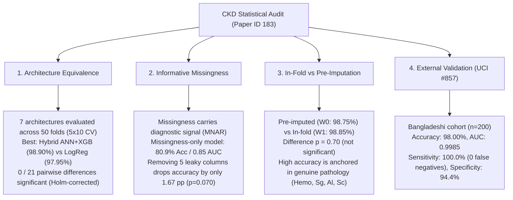

# How Much of Reported Chronic Kidney Disease Prediction Accuracy Is Real?
### A Statistical Audit, Leakage Analysis, and External Validation of Hybrid Stacking on the UCI Benchmark

[](https://www.python.org/downloads/)
[](https://opensource.org/licenses/MIT)
[](https://colab.research.google.com/)
[](https://scikit-learn.org/)

This repository contains the complete official replication package, benchmark suite, datasets, statistical significance tests, and out-of-fold predictions for **Paper ID 183**:  
> **"How Much of Reported Chronic Kidney Disease Prediction Accuracy Is Real? A Statistical Audit, Leakage Analysis, and External Validation of Hybrid Stacking on the UCI Benchmark"**

---

## 📌 Executive Summary & Headline Findings

Recent literature on Chronic Kidney Disease (CKD) classification frequently reports near-perfect performance ($98\% - 100\%$ accuracy) using complex deep neural networks or hybrid ensembles. This study conducts an extensive methodological audit addressing three critical questions:



### 1. Architecture Choice is Statistically Indistinguishable
Across seven distinct architectures (from simple Logistic Regression to complex Hybrid ANN-XGBoost ensembles), **none of the 21 pairwise accuracy differences are statistically significant** after Holm-Bonferroni correction using Nadeau-Bengio corrected paired $t$-tests ($0 / 21$ significant). Standard L2-regularized Logistic Regression ($97.95\%$) performs on par with the highest scoring Hybrid ANN+XGBoost ($98.90\%$, $\Delta = 0.95\text{ pp}$, corrected $p > 0.05$).

### 2. Informative Missingness (Data Leakage Audit)
Auditing against the original UCI raw dataset revealed that $231 / 400$ ($57.8\%$) patients carried genuinely missing clinical values, and $166 / 400$ ($41.5\%$) records in published benchmarks contained mean-imputation constants. 
- Missingness is strongly non-random (Missing Not At Random, MNAR) and label-associated ($9$ of $13$ features have statistically significant missingness correlated with CKD diagnosis, Fisher exact test $p < 0.05$).
- A **missingness-only model** trained strictly on missingness indicators (zero clinical values) attains **$80.9\%$ accuracy (AUC $0.850$)**, far exceeding the $62.5\%$ majority-class baseline.

### 3. Genuine Clinical Signal Persists Under Strict In-Fold Preprocessing
When all preprocessing is moved strictly **inside cross-validation folds** (restoring true NaNs and executing in-fold median imputation without leakage), XGBoost achieves **$98.85\%$ accuracy** (compared to $98.75\%$ with pre-imputation, $p = 0.70$). Completely removing the five most leakage-prone columns reduces accuracy by only $1.67\text{ pp}$ ($97.08\%$, corrected $p = 0.070$). This confirms the model is grounded in valid physiological markers rather than an imputation artifact.

### 4. External Validation on Independent Cohort (UCI #857)
Evaluating the model on an independent, external cohort from Dhaka, Bangladesh ($n=200$, 128 CKD / 72 non-CKD) yielded:
- **Accuracy**: $98.00\%$ (Exact 95% CI: $[95.0\%, 99.5\%]$)
- **AUC**: $0.9985$
- **Sensitivity**: $100.0\%$ (128 / 128 cases detected; **0 missed CKD diagnoses**)
- **Specificity**: $94.4\%$ (68 / 72 true negatives; 4 false positives)
- *Performance drop from in-dataset CV was only $0.75\text{ pp}$.*

---

## 📊 Benchmark Results

Evaluated using **5-Fold Stratified Cross-Validation repeated 10 times (50 fold evaluations)** with Nadeau-Bengio variance correction:

| Rank | Model Architecture | Accuracy (%) | Nadeau-Bengio 95% CI | AUC | F1 Score | Brier Score |
| :---: | :--- | :---: | :---: | :---: | :---: | :---: |
| 1 | **Hybrid ANN + XGBoost** | **98.90%** | [97.76%, 100.00%] | 0.9995 | 0.9912 | 0.0098 |
| 2 | **Random Forest** | **98.75%** | [97.63%, 99.87%] | 0.9998 | 0.9901 | 0.0112 |
| 3 | **XGBoost** | **98.60%** | [97.35%, 99.85%] | 0.9996 | 0.9888 | 0.0097 |
| 4 | **Hybrid ANN + Random Forest** | **98.45%** | [97.02%, 99.88%] | 0.9996 | 0.9876 | 0.0110 |
| 5 | **SVM (RBF Kernel)** | **98.35%** | [96.99%, 99.71%] | 0.9996 | 0.9867 | 0.0097 |
| 6 | **Logistic Regression** | **97.95%** | [96.51%, 99.39%] | 0.9994 | 0.9834 | 0.0133 |
| 7 | **Decision Tree** | **97.32%** | [95.74%, 98.91%] | 0.9730 | 0.9784 | 0.0268 |

---

## 🔍 Explainability & Clinical Decision Analysis

### 1. SHAP Physiological Attribution
SHAP (TreeExplainer) demonstrates that **four primary renal indicators account for $>82\%$ of total predictive importance**:
- **Hemoglobin (`Hemo`)**: $30.2\%$ relative importance
- **Specific Gravity (`Sg`)**: $20.2\%$ relative importance
- **Albumin (`Al`)**: $16.2\%$ relative importance
- **Serum Creatinine (`Sc`)**: $15.9\%$ relative importance

<p align="center">
  
</p>

### 2. Clinical Decision Curve Analysis (DCA)
Decision Curve Analysis confirms that the model yields superior clinical net benefit across the entire diagnostic threshold probability range ($p_t \in [0.03, 0.64]$) compared to default "treat all" or "treat none" referral protocols.

<p align="center">
  
</p>

### 3. Model Calibration & Reliability
All probabilistic models were evaluated with Expected Calibration Error (ECE), Hosmer-Lemeshow, and Spiegelhalter tests:

<p align="center">
  
</p>

---

## 📁 Repository Structure

```text
Chronic-Kidney-Disease/
│
├── README.md                          # Detailed project documentation and audit summary
├── requirements.txt                   # Complete dependencies for reproducibility
├── SPM_RESEARCH_7.ipynb               # Master replication notebook (Google Colab / Jupyter)
│
├── data/
│   ├── new_model.csv                  # Standard benchmark CSV (400 records, 13 features)
│   ├── new_model_input.csv            # Clean pre-imputed dataset
│   ├── new_model_observed_only.csv    # Dataset with ground-truth NaNs restored
│   ├── external_uci857_aligned.csv    # Aligned external validation cohort (n=200, Dhaka)
│   ├── true_missingness_mask.csv      # Ground-truth missingness boolean mask
│   └── cv_fold_assignments.csv        # Deterministic 5-fold x 10-repeat fold splits
│
├── results/
│   ├── results_df.csv                 # Master benchmark performance metrics
│   ├── oof_predictions.csv            # Pooled out-of-fold probability predictions
│   ├── per_fold_accuracy.csv          # Per-fold accuracy records across 50 splits
│   ├── table1_cohort_characteristics.csv # Baseline demographics (UCI-400 vs UCI #857)
│   ├── table_auc_significance.csv     # DeLong pairwise AUC tests
│   ├── table_calibration_stats.csv    # ECE, Brier score, and calibration slope/intercept
│   └── table_missingness_strata.csv   # Performance stratified by missing value count
│
└── figures/
    ├── shap_beeswarm.png              # SHAP summary distribution
    ├── shap_bar.png                   # SHAP global feature importance ranking
    ├── shap_waterfall.png             # Single-patient local explanation
    ├── feature_correlation.png        # Spearman correlation & multicollinearity matrix
    ├── reliability_plots.png          # Calibration curves
    └── decision_curve_v2.png          # Clinical Decision Curve Analysis
```

---

## 🚀 Quick Start & Reproduction

### 1. Clone the repository
```bash
git clone https://github.com/HarshaAppikatla/Chronic-Kidney-Disease.git
cd Chronic-Kidney-Disease
```

### 2. Environment Setup
```bash
python -m venv venv
# On Windows:
venv\Scripts\activate
# On Linux/macOS:
source venv/bin/activate

pip install -r requirements.txt
```

### 3. Run the Evaluation
Open and run `SPM_RESEARCH_7.ipynb` directly in Jupyter Lab or Google Colab:
```bash
jupyter lab SPM_RESEARCH_7.ipynb
```
*Total execution time is approximately 45–60 minutes on a standard CPU.*

---

## 📜 Citation & License

This project is licensed under the [MIT License](LICENSE).

If you use this benchmark, methodology, or audit code in your research, please cite:
```bibtex
@article{ckd_audit_paper183,
  title={How Much of Reported Chronic Kidney Disease Prediction Accuracy Is Real? A Statistical Audit, Leakage Analysis, and External Validation of Hybrid Stacking on the UCI Benchmark},
  author={Appikatla, Harsha and Contributors},
  journal={Paper ID 183 Revision Replication Package},
  year={2026}
}
```
