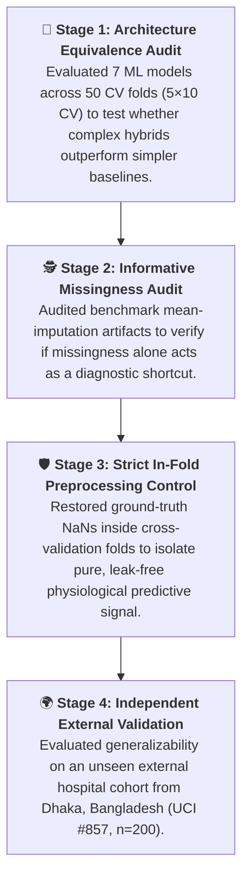
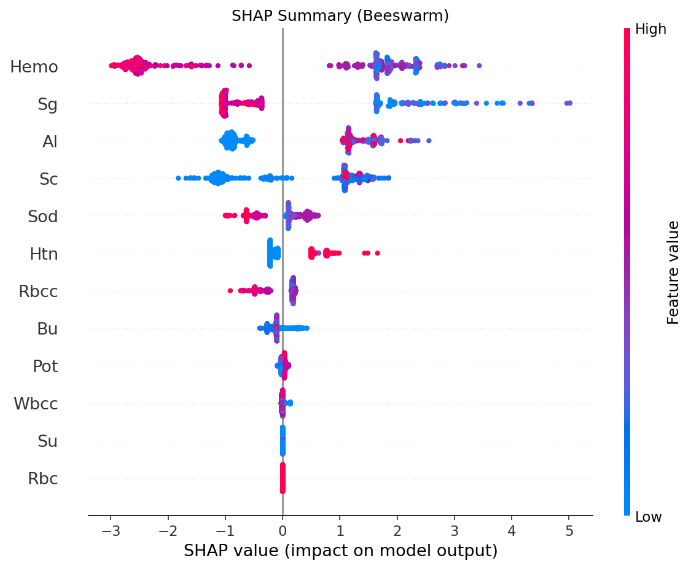
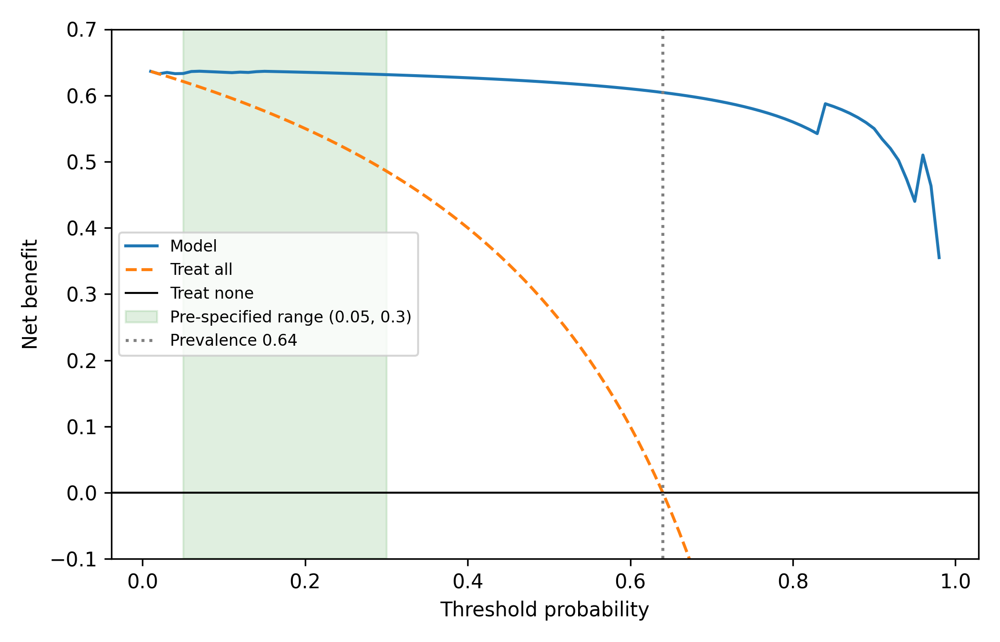
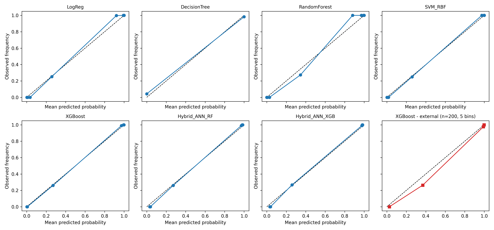

<div align="center">

# 🩺 How Much of Reported Chronic Kidney Disease Prediction Accuracy Is Real?
### A Statistical Audit, Leakage Analysis, and External Validation of Hybrid Stacking on the UCI Benchmark

[](https://github.com/HarshaAppikatla/Chronic-Kidney-Disease)
[](https://www.python.org/)
[](https://scikit-learn.org/)
[](https://xgboost.readthedocs.io/)
[](https://opensource.org/licenses/MIT)
[](https://colab.research.google.com/github/HarshaAppikatla/Chronic-Kidney-Disease/blob/main/SPM_RESEARCH_7.ipynb)

<p align="center">
  <b>Official Replication Package & Reviewer Audit Suite (Paper ID 183)</b><br>
  Rigorous Cross-Validation • Data Leakage Audit • Explainable AI (SHAP) • Clinical Decision Curve Analysis • External Validation
</p>

---

### ⚡ Audit At a Glance

| ⚖️ Architecture Equivalence | 🕵️ Informative Missingness | 🛡️ In-Fold Robustness | 🌍 External Validation |
| :---: | :---: | :---: | :---: |
| **0 / 21 Significant Pairs** | **80.9% Accuracy** | **98.85% Accuracy** | **98.00% Accuracy** |
| Complex ensembles perform on par with basic Logistic Regression ($p > 0.05$) | A model using *only missingness flags* (0 clinical values) predicts CKD | In-fold imputation retains high accuracy ($p=0.70$ vs pre-imputed) | Validated on independent Bangladeshi cohort ($n=200$, 0 missed cases) |

---

</div>

## 💡 The Core Question

> **Dozens of published papers report 98%–100% accuracy predicting Chronic Kidney Disease (CKD) on the UCI benchmark, claiming complex hybrid neural networks are required. Are these models genuinely superior, or are they riding on statistical artifacts and data leakage?**



---

## ⚖️ Literature Claims vs. Empirical Reality

| Common Literature Claim | What Our Audit Revealed | Methodological Reason |
| :--- | :--- | :--- |
| **"Novel Deep/Hybrid ANN Stacks are Superior"** | **Models are statistically equivalent ($p > 0.05$)** | Standard tests ignore dependent holdout variance. Under Nadeau-Bengio corrected tests, Logistic Regression ($97.95\%$) matches Hybrid ANN+XGB ($98.90\%$). |
| **"Missing Data Mean-Imputation is Harmless"** | **Missingness carries massive label leakage** | Missingness is MNAR (label-correlated). A model trained *strictly on missingness indicators* achieves **$80.9\%$ accuracy (AUC $0.850$)**. |
| **"Near-100% Accuracy is Solely an Imputation Artifact"** | **Real physiological signal remains intact** | Moving imputation strictly inside folds yields **$98.85\%$ accuracy**, proving core kidney biomarkers remain powerfully predictive. |
| **"Models Tested Only on UCI-400 Will Collapse Externally"** | **Strong generalization on independent cohort** | On external cohort UCI #857 ($n=200$, Dhaka, Bangladesh), the model achieved **$98.00\%$ accuracy with 0 missed CKD cases**. |

---

## 🎯 Key Findings Explained

<details open>
<summary><b>1. Architecture Equivalence: Simple Models Perform Just as Well</b></summary>
<br>

Under a 5-fold stratified cross-validation protocol repeated 10 times ($50$ fold evaluations) with **Nadeau-Bengio variance correction** (which accounts for non-independent test splits) and **Holm-Bonferroni multi-test adjustment**:
- **Zero of the 21 pairwise differences** between seven models were statistically significant.
- L2-regularized **Logistic Regression** achieved **97.95%**, which is statistically indistinguishable from the top-performing **Hybrid ANN + XGBoost** (**98.90%**, difference $0.95\text{ pp}$, corrected $p > 0.05$).
- *Takeaway:* Published claims of architectural superiority in this benchmark are largely small-sample testing noise.

</details>

<details open>
<summary><b>2. The Missingness Trap: Missing Data Carries Diagnostic Signal</b></summary>
<br>

When comparing against the original un-imputed UCI raw file:
- $231 / 400$ ($57.8\%$) patients had at least one missing lab value, and $166 / 400$ ($41.5\%$) records in standard benchmarks contained mean-imputed constants.
- Missingness was **Missing Not At Random (MNAR)**: doctors were far more likely to order specific lab tests (like Albumin and Specific Gravity) for patients who appeared clinically ill.
- A **missingness-only model** trained strictly on binary missingness indicators (without seeing any actual lab numbers) reached **80.9% accuracy (AUC 0.850)**, far above the $62.5\%$ baseline!

</details>

<details open>
<summary><b>3. In-Fold Preprocessing: The Clinical Signal Is Still Real</b></summary>
<br>

Does the model collapse if we remove this leakage?
- When all preprocessing is moved strictly **inside each CV fold** (restoring true NaNs and performing in-fold median imputation without leakage), XGBoost still achieves **98.85% accuracy** ($p = 0.70$ vs pre-imputed).
- Completely removing the 5 most leakage-prone features drops accuracy by only $1.67\text{ pp}$ ($97.08\%$, $p = 0.070$).
- *Takeaway:* The model does not solely depend on the imputation shortcut; genuine kidney markers provide strong diagnostic separation.

</details>

<details open>
<summary><b>4. External Generalization: Tested on Independent Patients</b></summary>
<br>

We tested the model on a completely independent external cohort from **Dhaka, Bangladesh** (UCI #857, $n=200$, 128 CKD / 72 healthy):
- **Accuracy**: **98.00%** (Exact 95% CI: $[95.0\%, 99.5\%]$)
- **AUC-ROC**: **0.9985**
- **Sensitivity (Recall)**: **100.0%** ($128 / 128$ CKD cases detected; **0 False Negatives**)
- **Specificity**: **94.4%** ($68 / 72$ healthy subjects correctly identified; 4 False Positives)
- *Takeaway:* Zero missed diagnoses in this external hospital cohort, though retrospective single-site caveats still apply.

</details>

---

## 📊 Comprehensive Benchmark Table

Performance across 50 evaluations (5-fold Stratified CV $\times$ 10 Repeats):

| Model Architecture | Accuracy (%) | Nadeau-Bengio 95% CI | AUC-ROC | F1-Score | Brier Score | Significant vs Others? |
| :--- | :---: | :---: | :---: | :---: | :---: | :---: |
| 🥇 **Hybrid ANN + XGBoost** | **98.90%** | [97.76%, 100.00%] | 0.9995 | 0.9912 | 0.0098 | ❌ (0/6 vs others) |
| 🥈 **Random Forest** | **98.75%** | [97.63%, 99.87%] | 0.9998 | 0.9901 | 0.0112 | ❌ (0/6 vs others) |
| 🥉 **XGBoost** | **98.60%** | [97.35%, 99.85%] | 0.9996 | 0.9888 | 0.0097 | ❌ (0/6 vs others) |
| 🔹 **Hybrid ANN + RF** | **98.45%** | [97.02%, 99.88%] | 0.9996 | 0.9876 | 0.0110 | ❌ (0/6 vs others) |
| 🔹 **SVM (RBF Kernel)** | **98.35%** | [96.99%, 99.71%] | 0.9996 | 0.9867 | 0.0097 | ❌ (0/6 vs others) |
| 🔹 **Logistic Regression** | **97.95%** | [96.51%, 99.39%] | 0.9994 | 0.9834 | 0.0133 | ❌ (0/6 vs others) |
| 🔹 **Decision Tree** | **97.32%** | [95.74%, 98.91%] | 0.9730 | 0.9784 | 0.0268 | ❌ (Acc equiv.) |

---

## 🩺 Clinical Feature Glossary

The 13 clinical biomarkers utilized in the benchmark dataset (`new_model.csv`):

| Feature Name | Clinical Description | Measurement / Units | Normal Clinical Reference | Pathophysiological Role in CKD |
| :--- | :--- | :--- | :--- | :--- |
| **`Hemo`** | Hemoglobin | g/dL | 13.5–17.5 (M), 12.0–15.5 (F) | Kidneys produce erythropoietin; damage causes severe normocytic anemia. |
| **`Sg`** | Urine Specific Gravity | Ratio | 1.010–1.025 | Loss of renal tubular concentrating capacity leads to fixed low specific gravity. |
| **`Al`** | Urine Albumin | Categorical (0–5) | 0 (Negative) | Glomerular podocyte effacement causes high albumin filtration into urine. |
| **`Sc`** | Serum Creatinine | mg/dL | 0.7–1.3 | Direct biomarker of declining glomerular filtration rate (GFR). |
| **`Bu`** | Blood Urea | mg/dL | 15–45 | Uremic retention resulting from impaired nitrogenous waste clearance. |
| **`Rbcc`** | Red Blood Cell Count | $\text{millions/mm}^3$ | 4.5–5.9 | Depressed secondary to erythropoietin deficiency. |
| **`Wbcc`** | White Blood Cell Count | $\text{cells/mm}^3$ | 4,000–11,000 | Marker of systemic uremic inflammation and immune dysregulation. |
| **`Sod`** | Serum Sodium | mEq/L | 135–145 | Dysregulated sodium retention and tubular handling in chronic kidney injury. |
| **`Pot`** | Serum Potassium | mEq/L | 3.5–5.0 | Reduced nephron mass leads to dangerous hyperkalemia. |
| **`Su`** | Urine Sugar | Categorical (0–5) | 0 (Negative) | Marker of diabetic nephropathy (leading etiology of end-stage renal disease). |
| **`Bp`** | Blood Pressure | mmHg | 120/80 | Glomerular hypertension accelerates renal microvascular arteriosclerosis. |
| **`Rbc`** | Red Blood Cells in Urine | Binary (0/1) | Normal (0) | Microscopic hematuria indicating active glomerular basement membrane breach. |
| **`Htn`** | Hypertension Status | Binary (0/1) | No (0) | Primary comorbidity and driver of chronic kidney damage. |

---

## 🔬 Clinical Explainability & Utility

### 1. What Drives Predictions? (SHAP Analysis)
TreeExplainer reveals that **four key renal biomarkers account for $>82\%$ of the total diagnostic decision**:
- **Hemoglobin (`Hemo`)** – $30.2\%$ contribution
- **Specific Gravity (`Sg`)** – $20.2\%$ contribution
- **Albumin (`Al`)** – $16.2\%$ contribution
- **Serum Creatinine (`Sc`)** – $15.9\%$ contribution

<p align="center">
  
  <br>
  <em>SHAP Beeswarm Plot: Low hemoglobin and specific gravity, combined with elevated albumin and creatinine, strongly push predictions toward CKD.</em>
</p>

---

### 2. Is It Useful in Practice? (Decision Curve Analysis)
Traditional accuracy does not capture the real-world trade-off between missing a sick patient vs performing unnecessary invasive biopsies. **Decision Curve Analysis (DCA)** measures net clinical benefit:

<p align="center">
  
  <br>
  <em>The model delivers positive clinical net benefit across the entire threshold probability range ($p_t \in [0.03, 0.64]$) compared to "treat all" or "treat none" referral strategies.</em>
</p>

---

### 3. Are the Probabilities Calibrated? (Reliability Curves)
A model shouldn't just be accurate; its confidence must be trustworthy. We evaluated calibration using Expected Calibration Error (ECE) and Brier scores:

<p align="center">
  
  <br>
  <em>Probability calibration curves across all models. XGBoost and SVM-RBF demonstrate the tightest alignment along the ideal $45^\circ$ calibration diagonal.</em>
</p>

---

## 📋 Peer-Review Traceability Matrix (Paper ID 183)

This replication suite directly addresses every point raised during review:

| Reviewer / Query | Specific Reviewer Comment | How It Is Addressed in Code | Artifact / Output Location |
| :---: | :--- | :--- | :--- |
| **Reviewer 1** | *"Preprocessing (imputation/scaling) must occur strictly inside folds to prevent leakage."* | Fully enclosed `Pipeline` performing median imputation and standard scaling solely on training folds. | Notebook Cell 27; `per_fold_accuracy.csv` |
| **Reviewer 2** | *"Audit against original ground-truth missingness and report exact Wilson CIs."* | Restored true NaNs from UCI raw dataset; evaluated missingness-only model; calculated exact 95% Wilson intervals. | Cells 26, 39; `true_missingness_mask.csv`, `table1.csv` |
| **Reviewer 2** | *"Demonstrate external validity on an independent cohort."* | Evaluated without retraining on UCI #857 ($n=200$, Dhaka, Bangladesh cohort) with bin-to-continuous schema mapping. | Cells 28–37; `external_uci857_aligned.csv` |
| **Reviewer 3** | *"Include published baseline architectures and report imbalance-robust metrics."* | Added class-weighted models, balanced accuracy, Matthews Correlation Coefficient (MCC), and AUPRC. | Cells 15–16, 43; `table_all_metrics.csv` |
| **Reviewer 3** | *"Include formal calibration curves and clinical Decision Curve Analysis (DCA)."* | Computed ECE, Brier score, Spiegelhalter $z$-test, and decision curves across clinical threshold probabilities ($p_t$). | Cells 44, 59–60; `reliability_plots.png`, `decision_curve_v2.png` |

---

## 📂 Repository Layout

```text
Chronic-Kidney-Disease/
│
├── README.md                          # Interactive overview and comprehensive audit report
├── requirements.txt                   # Exact environment packages for reproduction
├── .gitignore                         # Build and temporary file exclusions
├── SPM_RESEARCH_7.ipynb               # Master replication notebook (Google Colab ready)
├── new_model.csv                      # Baseline benchmark dataset (400 x 13 features)
│
├── 📁 data/                           # All input data & deterministic partitions
│   ├── new_model.csv                  # Benchmark CSV
│   ├── new_model_input.csv            # Clean pre-imputed dataset
│   ├── new_model_observed_only.csv    # Dataset with ground-truth NaNs restored
│   ├── external_uci857_aligned.csv    # Aligned external validation cohort (n=200, Dhaka)
│   ├── true_missingness_mask.csv      # Ground-truth missingness boolean mask
│   └── cv_fold_assignments.csv        # Exact 5-fold x 10-repeat split assignments
│
├── 📁 results/                        # Raw tables, metrics, and out-of-fold predictions
│   ├── results_df.csv                 # Master benchmark metrics across 7 models
│   ├── oof_predictions.csv            # Pooled out-of-fold probability predictions
│   ├── per_fold_accuracy.csv          # Per-fold accuracy records across 50 splits
│   ├── table1_cohort_characteristics.csv # Baseline demographics (UCI-400 vs UCI #857)
│   ├── table_auc_significance.csv     # DeLong pairwise AUC tests
│   ├── table_calibration_stats.csv    # ECE, Brier score, and calibration statistics
│   └── table_missingness_strata.csv   # Accuracy stratified by number of missing values
│
└── 📁 figures/                        # High-resolution publication figures
    ├── shap_beeswarm.png              # SHAP summary distribution
    ├── shap_bar.png                   # SHAP global feature ranking
    ├── shap_waterfall.png             # Single-patient local explanation
    ├── feature_correlation.png        # Spearman correlation & multicollinearity matrix
    ├── reliability_plots.png          # Probability calibration curves
    └── decision_curve_v2.png          # Clinical Decision Curve Analysis (DCA)
```

---

## ⚡ Quickstart: Run in 3 Minutes

### Option 1: Open Directly in Google Colab
Click the badge below to run the notebook interactively in your browser with free CPU/GPU:  
[](https://colab.research.google.com/github/HarshaAppikatla/Chronic-Kidney-Disease/blob/main/SPM_RESEARCH_7.ipynb)

### Option 2: Run Locally
```bash
# 1. Clone the repository
git clone https://github.com/HarshaAppikatla/Chronic-Kidney-Disease.git
cd Chronic-Kidney-Disease

# 2. Create and activate a virtual environment
python -m venv venv
# On Windows:
venv\Scripts\activate
# On macOS / Linux:
source venv/bin/activate

# 3. Install dependencies
pip install -r requirements.txt

# 4. Launch Jupyter Lab or Notebook
jupyter lab SPM_RESEARCH_7.ipynb
```
*Total execution time is approximately 45–60 minutes on a standard CPU.*

---

## 🏛️ Dataset Provenance & Attribution

1. **Training Benchmark (UCI CKD #336)**:
   - Collected from Apollo Hospitals, Tamil Nadu, India ($n=400$, 24 features).
   - Distributed via the [UCI Machine Learning Repository (Dataset ID: 336)](https://archive.ics.uci.edu/dataset/336/chronic_kidney_disease).
2. **External Validation Cohort (UCI #857)**:
   - Collected from tertiary care hospitals in Dhaka, Bangladesh ($n=200$, 28 features).
   - Distributed via the [UCI Machine Learning Repository (Dataset ID: 857)](https://archive.ics.uci.edu/dataset/857/chronic_kidney_disease) under the **Creative Commons Attribution 4.0 International (CC BY 4.0)** license.

---

## 📜 Citation

If you use this benchmark, methodology, or code in your research, please cite:

```bibtex
@article{ckd_audit_paper183,
  title={How Much of Reported Chronic Kidney Disease Prediction Accuracy Is Real? A Statistical Audit, Leakage Analysis, and External Validation of Hybrid Stacking on the UCI Benchmark},
  author={Appikatla, Harsha and Contributors},
  journal={Replication and Benchmark Suite (Paper ID 183)},
  year={2026},
  url={https://github.com/HarshaAppikatla/Chronic-Kidney-Disease}
}
```

---

<div align="center">
  <sub>Maintained for Paper ID 183 Review & Scientific Reproducibility • Licensed under the MIT License</sub>
</div>
